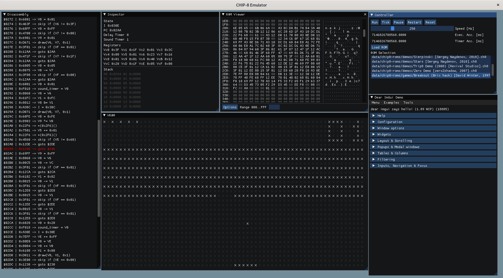

# CHIP-8 Emulator

[toc]

A CHIP-8 emulator written in C at the beginning of 2022, re-uploaded here as a public repository.




## Contents

This repository contains:

* C code for the CHIP-8 emulator under `chip8`.
* C++ code that uses the emulator plays games on it under `tools`.
* Some documentation I wrote while I was learning how to code the CHIP-8 emulator under `docs`.
* Dependencies under `data` (for games) and `vendor` (for code).
* Ready-to-use VSCode workspace under `misc`.


## Requirements

* Linux machine (might work under Windows)
* `gcc` or some other C/C++ compiler
* `cmake` version 3.13.
* `make`
* `SDL2` development libraries.
* Maybe something related to `GL`.


## Building and running

Tested on Linux. For building:

```sh
# You start at repository path
mkdir build/
cd build/
cmake ..
make
```

For running:

```sh
# You start at repository path
./build/bin/Emulator
```

If you are using VSCode, `Ctrl+Shift+B` to build either in Debug or Release mode, and `F5` to run a Debug build.


## Instructions of Use

After opening the emulator, you will be able to see a couple of windows:

* Disassembly -> shows the disassembly of the loaded ROM.
* Inspector -> shows the internal state of the CHIP-8 emulator.
* RAM Viewer -> shows the RAM of the CHIP-8 emulator.
* VRAM -> shows the video memory of the CHIP-8 emulator. I got too lazy and did not research how to render to a texture and then display it on ImGui.
* Controller -> controls the execution of the emulator: speed, play/pause/stop, ROM to load, ...
* Dear ImGui Demo -> forgot to remove it.

First, select a ROM to load from the list of ROMs available. Then, press Load ROM. The contents of the ROM will be loaded onto the chip, and the Disassembly, RAM Viewer and Inspector windows will be updated. Adjust the CHIP-8 speed for the game with the provided slider, then press run.

Keyboard controls:
- `space` -> CHIP-8 pause mode
- `F10` -> CHIP-8 tick mode
- `F5` -> CHIP-8 run mode
- `0`..`9` -> CHIP-8 keypad numbers
- `a`..`f` -> CHIP-8 keypad letters

For specific instructions on how to play each game, read their documentation (it comes along the game ROM).


## Acknowledgments

This repository has following submodules:

* ImGui -> https://github.com/ocornut/imgui.git
* ImGui Club -> https://github.com/ocornut/imgui_club
* CHIP-8 Roms -> https://github.com/kripod/chip8-roms.git

This repository also uses SDL2.


## References

- Wikipedia Article -> https://en.wikipedia.org/wiki/CHIP-8
- Technical Reference -> https://github.com/mattmikolay/chip-8/wiki/CHIP%E2%80%908-Technical-Reference
- Instruction Set -> https://github.com/mattmikolay/chip-8/wiki/CHIP%E2%80%908-Instruction-Set
- Emulator 101 -> http://emulator101.com/